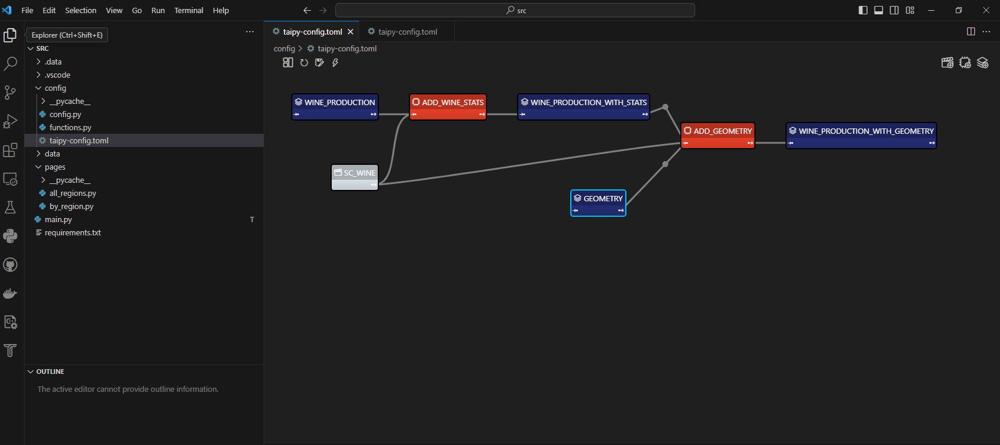

[](https://github.com/psf/black)


# TAIPY Wine Dashboard

## Introduction

Welcome to the **TAIPY Wine Dashboard**, a demonstration project showcasing some capabilities of [Taipy](https://docs.taipy.io), a Python library for building interactive applications. 

This dashboard allows you to explore wine production data for various French wine regions, providing insights into production statistics, geographical distribution, and more. Building Business Intelligence (BI) dashboards.


The application uses both Taipy GUI and Taipy Core. You can open the ```config.toml``` file with Taipy studio on VS Code.



## Features

- **Multi-Page Dashboard:** Navigate through different pages to explore diverse aspects of wine production data.

- **Region-Based Analysis:** Analyze wine production data by region, including breakdowns for red, white, and rose wines.

- **Geographical Mapping:** Visualize wine production on a map, with color-coded markers representing different wine types.

- **Dynamic Data Updates:** The dashboard dynamically updates data based on the selected year and area type.

## Getting Started

### Installation

Ensure you have the required dependencies installed. You can install them using the following:

```bash
pip install -r requirements.txt
```

The app uses [Pandas](https://pandas.pydata.org/) and [GeoPandas](https://geopandas.org/en/stable/index.html) Python libraries.

### Data

#### Wine production by year and region

You can download the CSV data from [Kaggle](https://www.kaggle.com/datasets/ericnarro/volumes-wine-production-aoc-2009-2019). The source data is actually a [pdf file from a French pblic organism](https://www.franceagrimer.fr/fam/content/download/62836/document/chiffres-fili%C3%A8re-viti-vinicole-2008-2018.pdf?version=) that does some statistics about agriculture. I explained how to get the data [in my personal blog](https://www.ericnarrodata.com/blog/2023/pdf_table_wine_production.html).

#### Centroids for the wine regions

The centroids [come from another file](https://www.kaggle.com/datasets/ericnarro/french-wine-aop-regions) that I also listed on Kaggle, and that file comes from [official data from the French Government](https://www.data.gouv.fr/fr/datasets/cartes-des-grandes-regions-productrices-de-vins-aop-en-france/#/community-reuses). [This notebook shows how I created the centroids](https://www.kaggle.com/code/ericnarro/create-centroid-points-from-a-layer-of-polygons). 