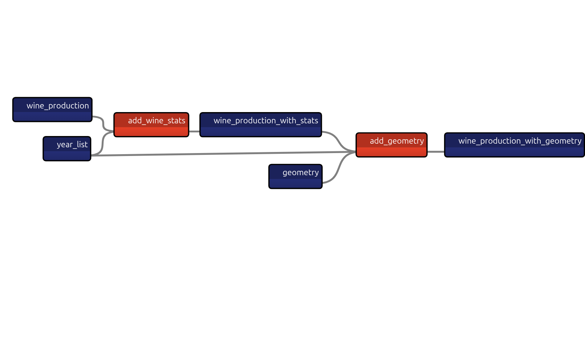

# TAIPY Wine Dashboard

[](https://github.com/psf/black)


[](https://codecov.io/github/enarroied/taipy_wine_app)


- [TAIPY Wine Dashboard](#taipy-wine-dashboard)
  - [Introduction](#introduction)
  - [Medium Article](#medium-article)
  - [Features](#features)
  - [Getting Started](#getting-started)
    - [Installation](#installation)
    - [Data](#data)
      - [Wine production by year and region](#wine-production-by-year-and-region)
      - [Centroids for the wine regions](#centroids-for-the-wine-regions)
  - [Running Taipy Wine App](#running-taipy-wine-app)
    - [Run Locally](#run-locally)
    - [Run with Docker](#run-with-docker)

## Introduction

Welcome to the **TAIPY Wine Dashboard**, a demonstration project showcasing some capabilities of [Taipy](https://docs.taipy.io), a Python library for building interactive applications.

This dashboard allows you to explore wine production data for various French wine regions, providing insights into production statistics, geographical distribution, and more. Building Business Intelligence (BI) dashboards.


The application uses both Taipy GUI and Taipy Core. You can open the ```config.toml``` file with Taipy studio on VS Code.



## Medium Article

📚 [Long ago, I wrote an article about this app.](https://medium.com/gitconnected/create-a-dashboard-app-with-taipy-bc3b1fcfb3b0) 📚

**I DO NOT RECOMMEND taking that article as reference to learn Taipy**, for two reasons:

- It uses outdated versions of Taipy and the Markdown syntax, which is not ideal. You are better off using the Python API.
- When I wrote this article, my coding skills and my understanding of Taipy (both) were not great.

**However**, I have refactored the application ever since, and the code is now in better shape. [I saved the older version for reference in a dedicated branch](https://github.com/enarroied/taipy_wine_app/tree/original_app). Please ignore it.

If you want to learn Taipy, here are some resources you may want to explore:

- [Getting Started with Taipy](https://amzn.to/3O2QXQw), my book about Taipy
- [I wrote plenty of Medium articles about Taipy](https://medium.com/@ericnarro/list/taipy-0e2b6bbedeb1)
- [Taipy's documentation](https://docs.taipy.io/en/latest/tutorials/getting_started/)

## Features

- **Multi-Page Dashboard:** Navigate through different pages to explore diverse aspects of wine production data.

- **Region-Based Analysis:** Analyze wine production data by region, including breakdowns for red, white, and rose wines.

- **Geographical Mapping:** Visualize wine production on a map, with color-coded markers representing different wine types.

- **Dynamic Data Updates:** The dashboard dynamically updates data based on the selected year and area type.

## Getting Started

### Installation

Ensure you have the required dependencies installed. You can install them using the following:

```bash
pip install -r requirements.txt
```

The app uses [Pandas](https://pandas.pydata.org/) and [GeoPandas](https://geopandas.org/en/stable/index.html) Python libraries.

### Data

#### Wine production by year and region

You can download the CSV data from [Kaggle](https://www.kaggle.com/datasets/ericnarro/volumes-wine-production-aoc-2009-2019). The source data is actually a [pdf file from a French public organism](https://www.franceagrimer.fr/fam/content/download/62836/document/chiffres-fili%C3%A8re-viti-vinicole-2008-2018.pdf?version=) that does some statistics about agriculture. I explained how to get the data [in my personal blog](https://www.ericnarrodata.com/blog/2023/pdf_table_wine_production.html).

#### Centroids for the wine regions

The centroids [come from another file](https://www.kaggle.com/datasets/ericnarro/french-wine-aop-regions) that I also listed on Kaggle, and that file comes from [official data from the French Government](https://www.data.gouv.fr/fr/datasets/cartes-des-grandes-regions-productrices-de-vins-aop-en-france/#/community-reuses). [This notebook shows how I created the centroids](https://www.kaggle.com/code/ericnarro/create-centroid-points-from-a-layer-of-polygons).

## Running Taipy Wine App

You can run this application either **locally** or inside a **Docker container**.

⚠️ Note: The provided code is **not production-grade**: it runs on Taipy’s default Flask server.
In the future, I may adapt this to use a more robust WSGI server (e.g. Gunicorn).

### Run Locally

To run locally, you can use [`uv`](https://docs.astral.sh/uv/) to create a virtual environment and install dependencies from `pyproject.toml`:

```bash
uv venv
uv pip install -r pyproject.toml
```

Then run the app:

```bash
cd src
python main.py
```

Or, from the project root, directly with uv:

```bash
uv run --directory src main.py
```

### Run with Docker

Build the Docker image:

```bash
docker build -t taipywineapp .
```

Run the container (mapping port 5000):

```bash
docker run -p 5000:5000 taipywineapp
```

You can then access the app at: http://localhost:5000

**The Dockerfile:**

- Uses Python 3.11 as the base.
- Installs uv.
- Copies pyproject.toml and uv.lock and installs dependencies at build time (not at runtime).
- Runs as a non-root user (appuser) for better security.
- Exposes port 5000 (default Taipy/Flask port).
- Defines a healthcheck so Docker can monitor container health.
- Runs the app with:

  ```bash
  taipy run --no-debug --no-reloader main.py -H 0.0.0.0 -P 5000
  ```
